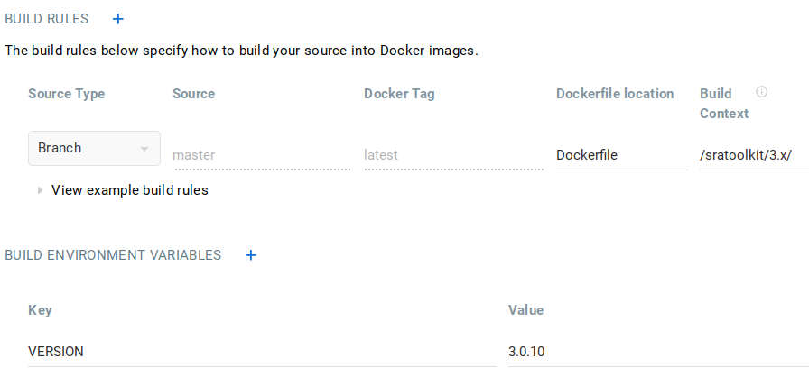

# Building images

## Local

All images can be built locally from their respective directories. Some of them include a `BUILD.md` file with the specific `docker build` command used.

## Docker Hub

Some images are configured to be built automatically from Docker Hub using the *Automated Builds* feature. This is specially interesting for software packages that are frequently updated (e.g. BLAST, SeqKit, sratoolkit, and so on), as the built can be triggered directly at Docker Hub without making a commit.

### Images with frequent releases

The Dockerfiles of such images have a `VERSION` argument that specifies the software version that should be downloaded. This way, the Dockerfile is generic and can be used to build an image for any software version (available at the releases URL). For instance, this is the sratoolkit Dockerfile:

```docker
FROM ubuntu:22.04

ARG VERSION

RUN apt-get update \
	&& apt-get install -y wget libxml-libxml-perl

RUN wget https://ftp-trace.ncbi.nlm.nih.gov/sra/sdk/${VERSION}/sratoolkit.${VERSION}-ubuntu64.tar.gz -O /tmp/sratoolkit.tar.gz \
	&& tar zxvf /tmp/sratoolkit.tar.gz -C /opt/ && rm /tmp/sratoolkit.tar.gz

ENV PATH="/opt/sratoolkit.${VERSION}-ubuntu64/bin/:${PATH}"
```

The Docker Hub [advanced options for autobuild](https://docs.docker.com/docker-hub/builds/advanced/) allows setting a build configuration to built such images. This requires three things:

1. Set the automated builds configuration as follows. There is only one build rule for the latest image and then the `VERSION` environment variable with the specific software version.



2. A `build` hook script as the following. When present at the `hooks` directory, Docker Hub uses it to build the Docker image. In this case, it takes the `VERSION` environment variable and, if present, passes it to the `docker build` command. The image is created with the `latest` tag.

   ```bash
   #!/bin/bash

    if [ -z ${VERSION} ]; then 
        echo "VERSION environment variable not set."
        exit 1
    else
        echo "Building ${VERSION}"
        docker build -f ${DOCKERFILE_PATH} --build-arg VERSION=${VERSION} -t ${IMAGE_NAME} .
    fi
   ```

3. A `post_push` hook script to tag the `latest` image build in the previous step as `our_image:version`. The following script tags the image and pushes it to the associated repository.

   ```bash
    #!/bin/bash

    if [ -z ${VERSION} ]; then 
        echo "VERSION environment variable not set."
        exit 1
    else
        echo "Tagging ${IMAGE_NAME} as ${DOCKER_REPO}:${VERSION}"
        docker tag ${IMAGE_NAME} ${DOCKER_REPO}:${VERSION}
        docker push ${DOCKER_REPO}:${VERSION}
    fi
   ```