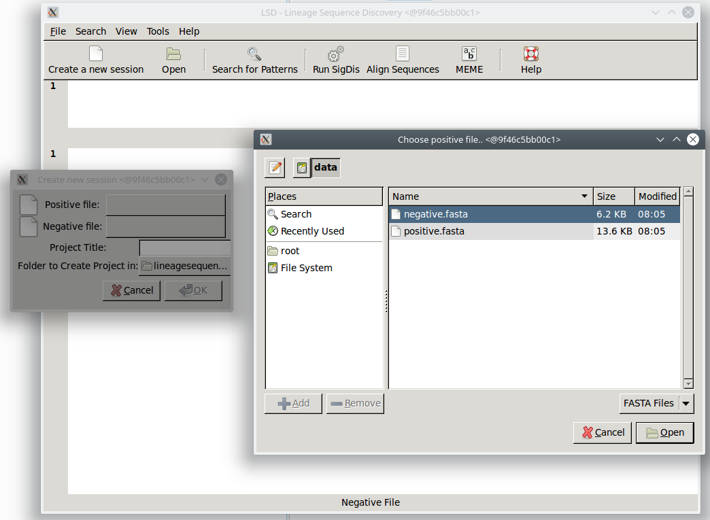
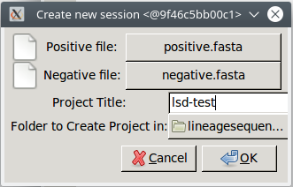
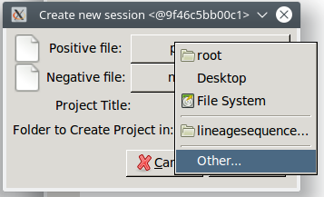
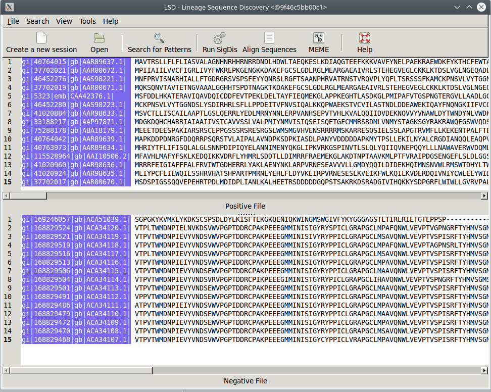
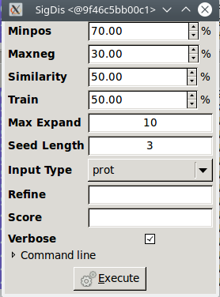
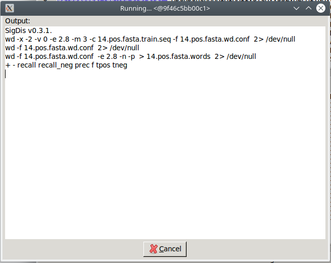
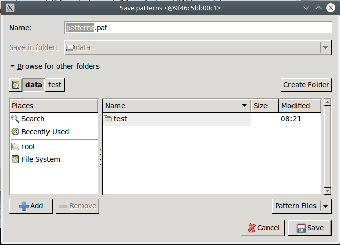
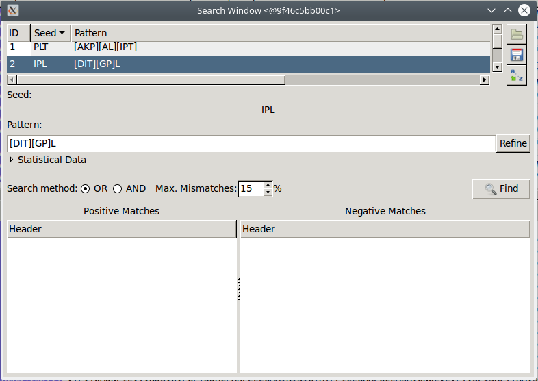

# LSD example

This tutorial guides you trough the basic steps to find patterns using the LSD Docker image. The two input test files `positive.fasta` and `negative.fasta` are available [here](https://github.com/pegi3s/dockerfiles/tree/master/lsd/test_data).

To run LSD, you should adapt and run the following command: `docker run --rm -ti -e USERID=$UID -e USER=$USER -e DISPLAY=$DISPLAY -v /var/db:/var/db:Z -v /tmp/.X11-unix:/tmp/.X11-unix -v $HOME/.Xauthority:/home/developer/.Xauthority -v "/your/data/dir:/data" -v /var/run/docker.sock:/var/run/docker.sock pegi3s/lsd`

If the above command fails, try running `xhost +` first. In this command, you should replace:
- `/your/data/dir` to point to the directory that contains the test data. Then, carry out the following steps:

1. Click the `Create a new session` button to create a new session and select the input files.

2. Give your project a title and select the project location.  To create it in a different location than the default (e.g. `/data`), you must select `Other` in the `Folder to Create Project in:` option of the new session dialog. This will open a file selection dialog where you can find the `/data` directory.

3. Click the `OK` button to finish the project creation process. The two input FASTA files will be opened.

4. Click the `Run SigDis` to find patterns. This will open a configuration dialog where you can set diferent parameters. Leave the default values and click the `Execute` button to start the analysis.

5. When the analysis finishes, a dialog to save the patterns into a file will appear. In this dialog, you must save it with `.pat` extension. This way, LSD will be able to load it automatically. Otherwise, it won't be opened since LSD require the pattern files to end with `.pat`.

6. And finally, the search window is opened to refine the patterns discovered.

