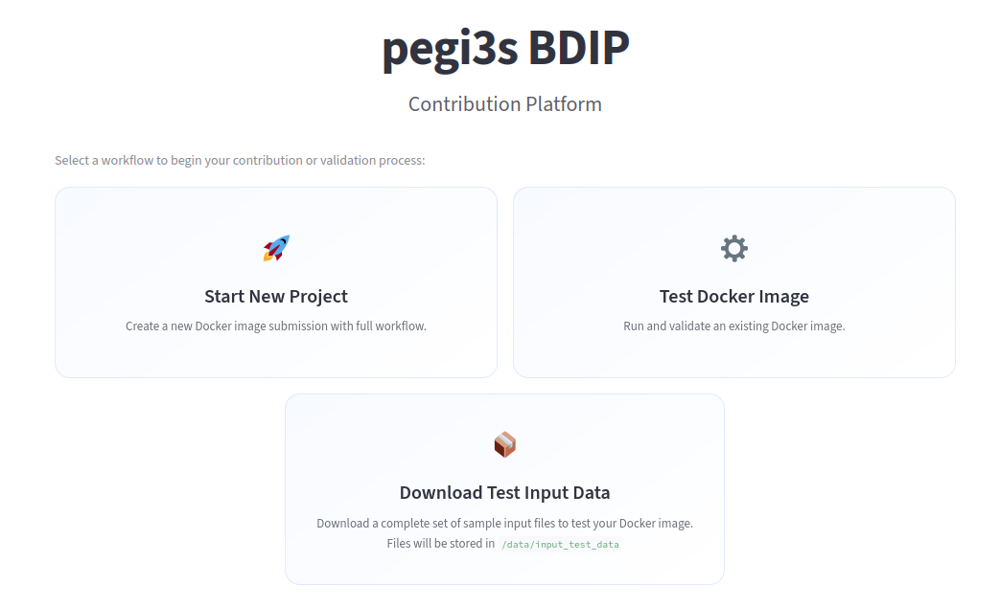
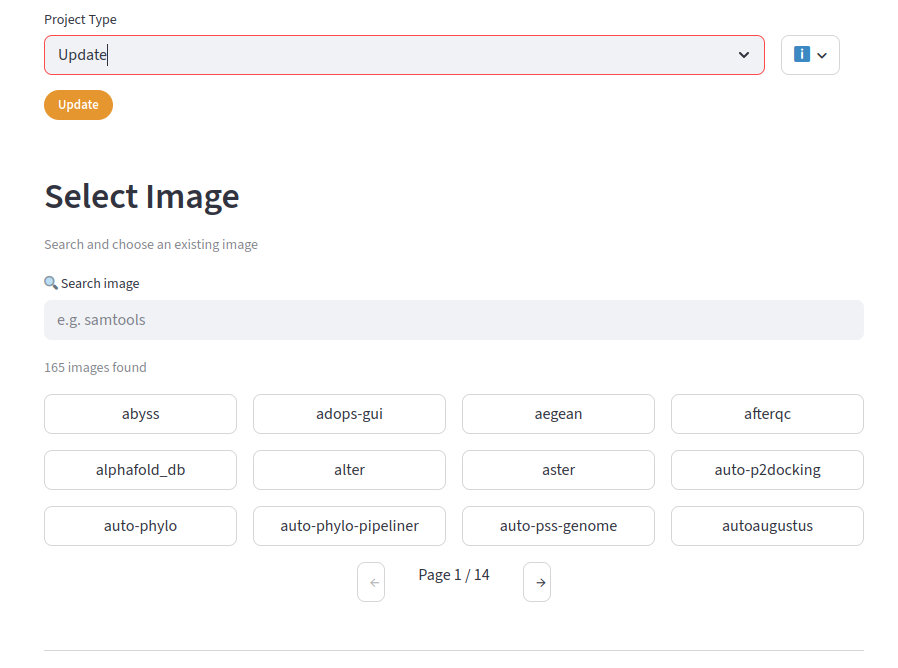
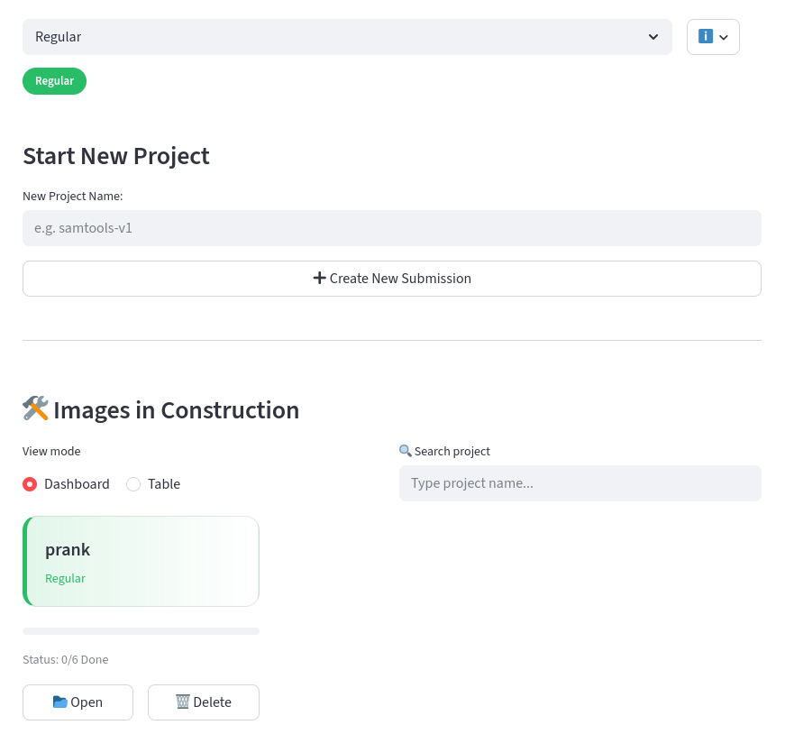
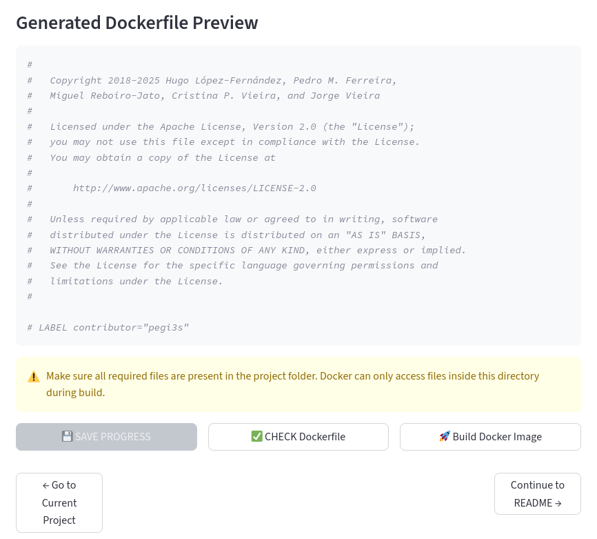
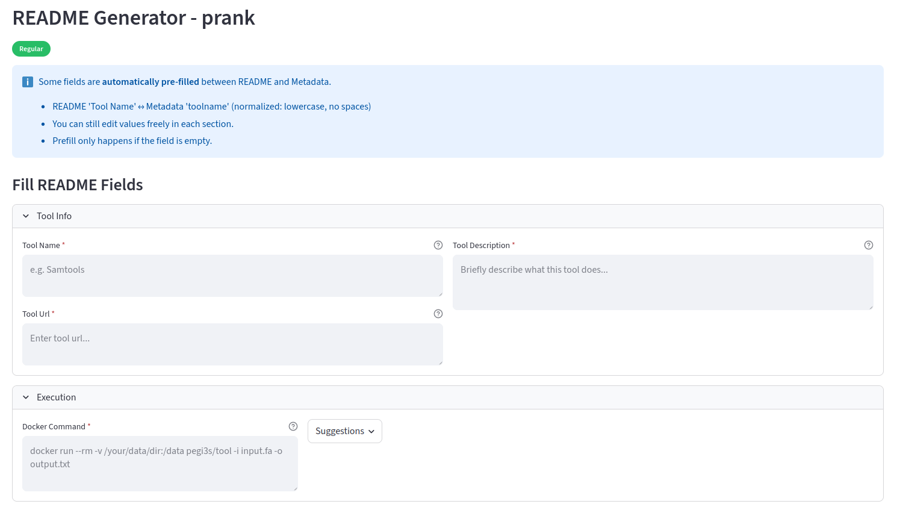
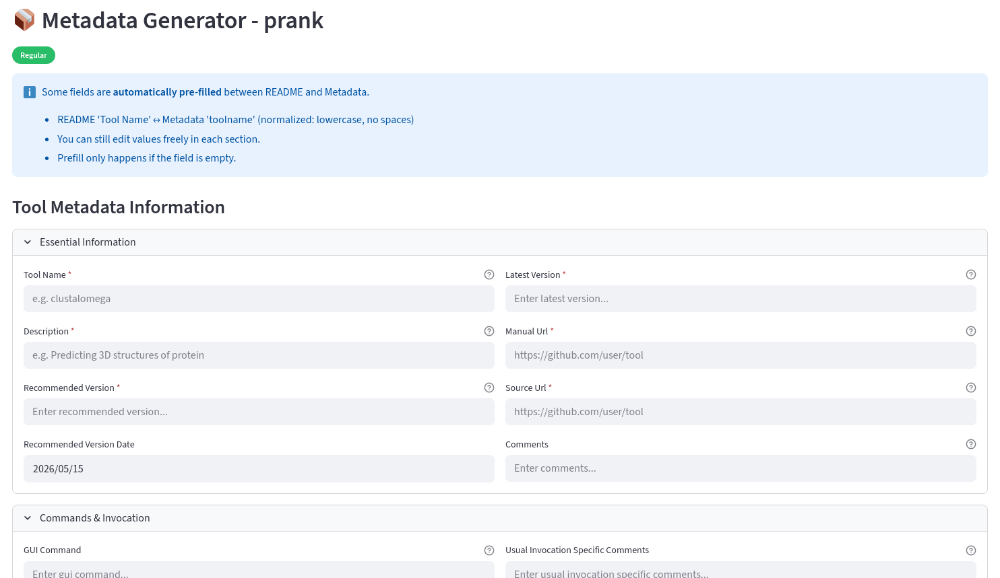

# Contribute New Docker Images

We’ve all been there: you spend days wrestling with dependencies, conflicting package versions, and obscure installation guides just to get a single bioinformatics tool running. Moreover, when using the software, you suddenly realize that it only accepts FASTA files without line breaks in the middle of the sequence. Having test data for the application would have made all the difference… The hours you spent trying to see what was the problem… But even when there is no problem at all, do you really remember how to invoke all the programs you use? Having at least one example on how to use the software, as well as a link at hand to the manual would have been helpful… Where is that black book with those commands?
 
The above issues can only be solved by providing standardized Docker images and useful information on them so that everyone can use them easily. This is what we are trying to do at the pegi3s Bioinformatics Docker Images project. But creating, testing, and providing the needed information takes time and effort. Nevertheless, with your help, the project can grow more easily. By contributing Docker images to this project, you aren't just giving away code, but rather you are actively accelerating scientific research by helping to break down the technical barriers that slow down amazing biological discoveries, as well as contributing to increase repeatability and reproducibility. But your contribution should not take too much of your precious time. This is why we have developed the pegi3s/contribute (https://hub.docker.com/r/pegi3s/contribute) Docker image that, among others, lets you:

Download the test data files that are already being used to test other Docker images, in case they can be reused.



Update the version of an existing Docker image.



Create a new Docker image. No need to do it all at once. All progress will be saved. You can even work with several projects simultaneously.



Run automated checks to ensure your container behaves exactly as expected before sending us your contribution.



Effortlessly create a README.md file that follows the pegi3s Bioinformatics Docker Images project guidelines.



Effortlessly add the required metadata: No need to guess formatting rules.



Provide all files in a standardized way, so that they can be easily and quickly inspected before making the new Docker image available.

Running the contribute Docker Image

Since the application has a graphical interface, you may have to run the following command to allow Docker to access the X11 display:

```bash
xhost +
```
Then you should run:

```bash
docker run -v /var/run/docker.sock:/var/run/docker.sock   -v /contribute_history:/contribute_history -e USERID=$UID   -e USER=$USER   -e DISPLAY=$DISPLAY   -v /tmp/.X11-unix:/tmp/.X11-unix   -v /your/data/dir:/data pegi3s/contribute
```

Where `/your/data/dir` points to the directory where the files ready for submission will be created.

Check out our project, pull the pegi3s/contribute image, and submit your first image today!

