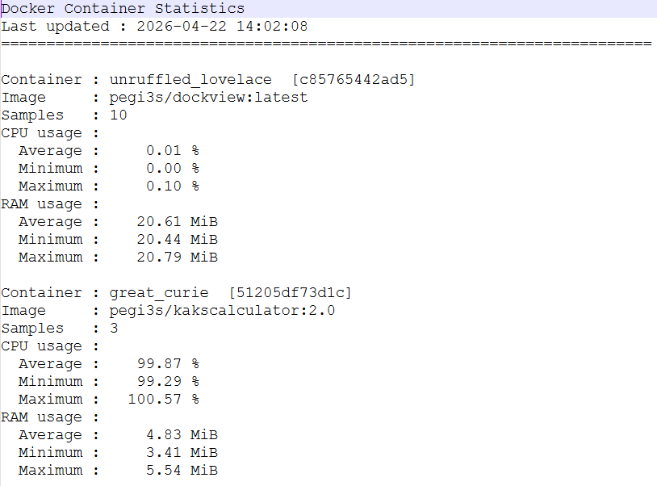

# Monitor Docker images CPU and RAM usage



> [!WARNING]
> This image runs Docker in Docker version 29, and thus is only compatible with Docker 29.

When the need to run multiple Docker images arises, you may wonder whether your machine has the resources to run several Docker images at once. While for most bioinformatics programs the needed resources vary with input dataset size, there is always the possibility of running a typical project in isolation first and determine CPUs and RAM usage. The Dockview image facilitates this process by recording the average, minimum and maximum CPU and RAM usage for every running Docker image from the moment it is launched. It should be noted that 100% CPU usage is the full usage of a single CPU. Results are saved on a continuously updated file, named by the user, in the current directory (`/data` in the command below). The Dockview tool has a low CPU and RAM resource usage.

In order to run Dockview, execute the following Docker command in the working directory:

```bash
docker run -v $PWD:/data -v /var/run/docker.sock:/var/run/docker.sock pegi3s/dockview -t 1 -o /data/output
```

Where `-t 1` means that sampling will be performed every five seconds and `output` is the name of the file where the output will be saved.

Please, note that in the case of Docker images that run other Docker images, the CPU and RAM usage of the different Docker images should be added.
