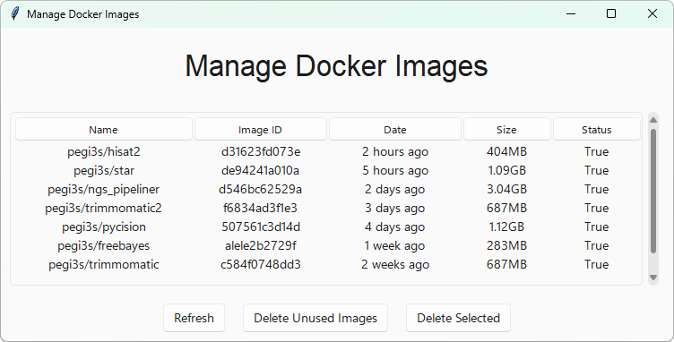

# Manage Docker Images



> [!WARNING]
> This image runs Docker in Docker. Users that are already running Docker 29 should start using the image with the `v1.2`, while users that did not yet update their Docker version to Docker 29 should use the image with the `v1.1` tag. Starting with version `v1.1.1-docker29.0.1`, from now on, only images that are compatible with Docker 29 or above will be released. You can check your Docker version by running the command: docker --version".

After running several Docker images, you may lose track of the images available on a given computer. You may want to delete Docker images that you are not going to use again soon to save hard disk space or erase leftover Docker images that remain after an unexpected restart. All these operations can be managed using the [**pegi3s/docker-manager**](http://bdip.i3s.up.pt/container/docker-manager) image, which provides a simple graphical interface for managing Docker images.

> [!IMPORTANT]
> It is not possible to erase Docker images that are being used in the computer where docker-manager is running.  
> If an image can be deleted, it means it is not actively being used.

Since the application has a graphical interface, you must run the following command to allow Docker to access the X11 display:

```bash
xhost +
```

After running the command, execute the following Docker command to run the Docker Manager interface:

```bash
docker run --rm -ti -e USERID=$UID -e USER=$USER -e DISPLAY=$DISPLAY -v /var/db:/var/db:Z -v /tmp/.X11-unix:/tmp/.X11-unix -v $HOME/.Xauthority:/home/developer/.Xauthority -v /var/run/docker.sock:/var/run/docker.sock -v /tmp:/tmp pegi3s/docker-manager
```

This command will start the Docker Manager interface, allowing you to easily manage your Docker images. You can delete, view, or perform other operations on the images as needed.
