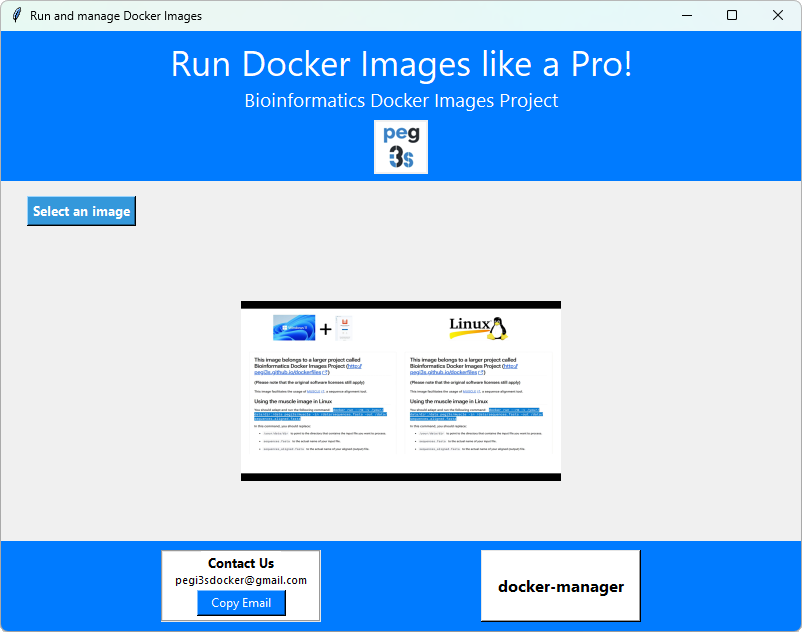
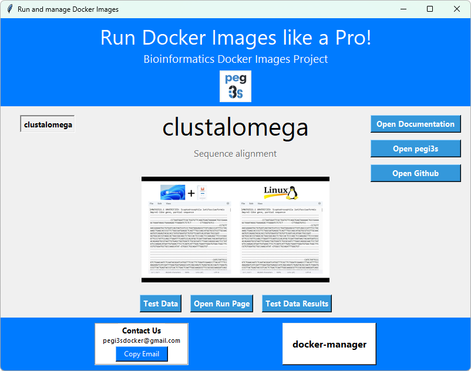
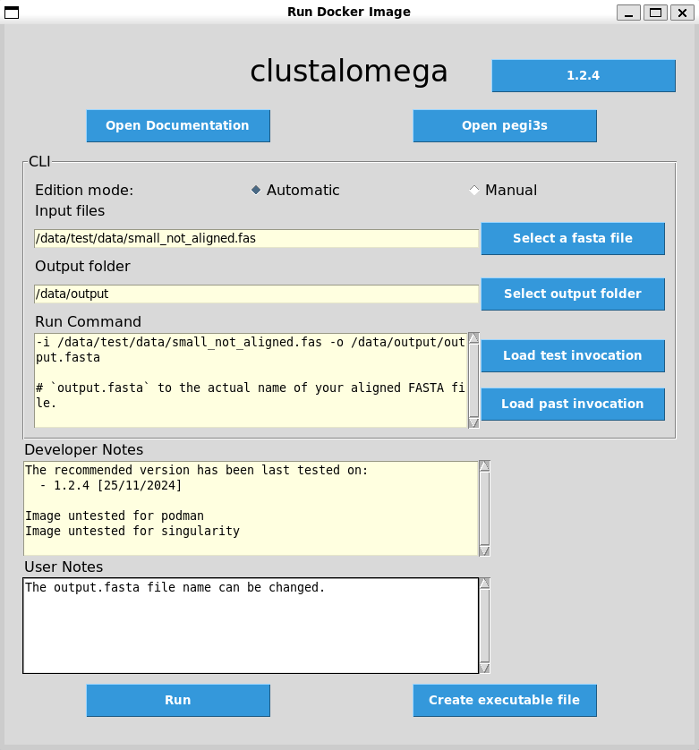
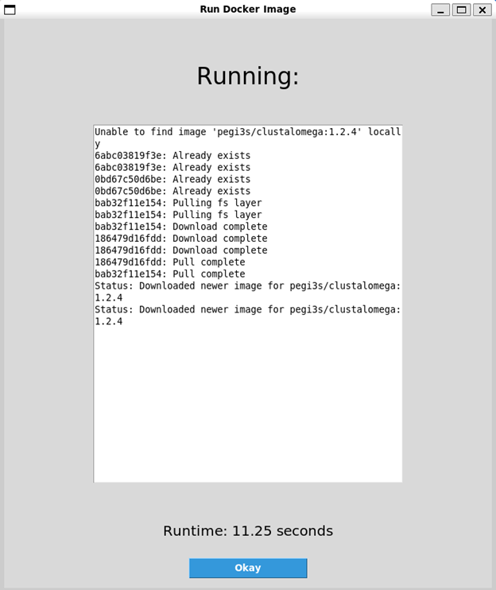

# Run commands using a GUI

docknrun is a Docker image that offers a graphical interface (GUI) that facilitates:

* The **choice** (through the "Select an Image" button; Figures 1 and 2).
* The **management** (through the "docker-manager" button that launches an instance of the docker-manager Docker image; Figure 1).
* The **running** of Docker images (Figure 3).

In the main window, the "pegi3s" button also offers a convenient way to access the web page of the project ([http://bdip.i3s.up.pt/](http://bdip.i3s.up.pt/)), and informative videos are displayed.

## Main Window

The **"Select an Image"** button allows choosing the desired Docker image using the same ontology information that is implemented at [http://bdip.i3s.up.pt/](http://bdip.i3s.up.pt/). When this is done, buttons are made available to:

* **Open documentation** for the software of choice ("Open documentation" button).
* Access information at [http://bdip.i3s.up.pt/](http://bdip.i3s.up.pt/) for the selected Docker Image ("Open pegi3s" button).
* Open the corresponding **GitHub page** ("Open GitHub" button).
* Open the corresponding **source code page** ("Open source code" button).
* Access **Test Data** for the selected image ("Test Data" button; test data is already available for most Docker images, and will be soon available for all of them).
* Access **Test Data Results** ("Test Data Results" button).

By selecting the **"Open Run Page"** button, another window is displayed (Figure 3) where the user can make decisions on how to run the desired software.

<div class="figure-pair">
  <figure>
    
    <figcaption>Figure 1. docknrun main window</figcaption>
  </figure>
  <figure>
    
    <figcaption>Figure 2. docknrun main window showing the selection of the Docker image "clustalomega".</figcaption>
  </figure>
</div>

## Run Docker Image Window

In the docknrun **"Run Docker Image"** window, the user can:

* Check the documentation for the selected image.
* Choose the image version (e.g., `clustalomega:1.2.4` in Figure 3; the Docker image version usually matches the software version).
* Select the **input data** (e.g., "Select a fasta file" button in Figure 3).
* Specify the **output folder** ("Push" button; the folder will be created if it does not exist).
* View **Developer Notes** (e.g., bug reports, Singularity/Podman compatibility, last testing date).
* Add **User Notes** (comments for future reference stored in the `documentation_folder` folder in the working directory).

### Working Directory Notes

If the user wants to change the working directory, they should copy the `documentation_folder` folder to the new location. Otherwise, the user history (comments, saved executable, and latest invocation files) will be lost.

### Additional Features

* **Create executable file**: Generates executable files.
* **Latest invocation**: Loads the latest invocations of the selected image.
* **Test Data Invocation**: Adapts the command in the "Run command" box to use test data (test data must be downloaded first).

By selecting the **"Run"** button, a new window opens to display the operations underway and the time it took to complete the requested analysis (Figure 4). If the selected image does not need to be pulled, nothing may be shown in the "running" box.

<div class="figure-pair">
  <figure>
    
    <figcaption>Figure 3. docknrun "Run Docker Image" window.</figcaption>
  </figure>
  <figure>
    
    <figcaption>Figure 4. docknrun "Run Docker Image" secondary window.</figcaption>
  </figure>
</div>

## Running docknrun Docker Image

To run this Docker image, you must have a file named `config` in the working directory. This file declares the location of the files to be processed, such as:

```bash
dir="/full/path/to/data/folder"
documentation_folder="/data/documentation_folder"
```

Then, adapt and run the following command (you may need to invoke `xhost +` first):

```bash
docker run --rm -ti \
-e USERID=$UID \
-e USER=$USER \
-e DISPLAY=$DISPLAY \
-v /var/db:/var/db:Z \
-v /tmp/.X11-unix:/tmp/.X11-unix \
-v $HOME/.Xauthority:/home/developer/.Xauthority \
-v /var/run/docker.sock:/var/run/docker.sock \
-v /tmp:/tmp \
-v /your/data/dir:/data \
pegi3s/docknrun
```

Where `/your/data/dir` points to the directory containing the config file.
