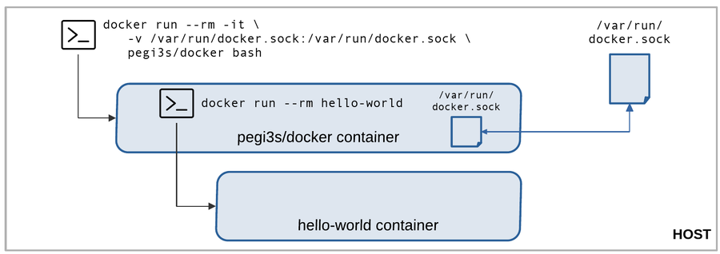
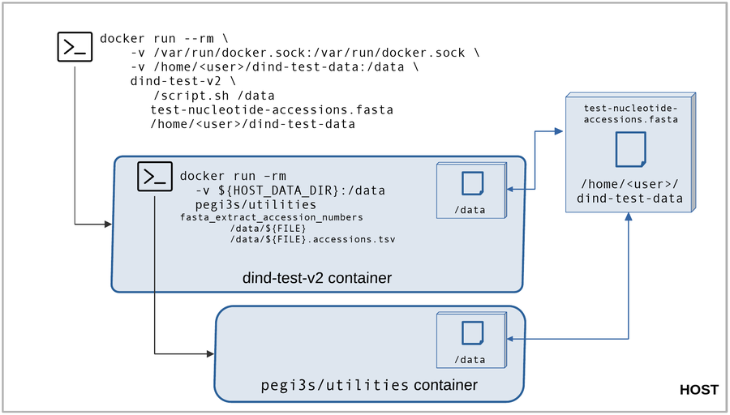

# Running Docker commands inside Docker containers

Sometimes we need to run Docker commands inside Docker containers. For instance, when developing a pipeline that is provided as a Docker image and that runs dependencies using Docker commands.

This guide demonstrates how to run Docker commands using Docker images from our *Bioinformatics Docker Images Project*. You can use the [`pegi3s/docker`](https://hub.docker.com/r/pegi3s/docker) image for the examples.

## 1. Running Docker inside a Docker container

To do so, the Docker client must be installed in the Docker image that will run Docker commands. This is what we have done in the [`pegi3s/docker`](https://hub.docker.com/r/pegi3s/docker) image.

If we start a Docker container of this image in interactive mode with `docker run --rm -it pegi3s/docker bash` and then run a Docker command like `docker images`, we get the following message:

```
Cannot connect to the Docker daemon at unix:///var/run/docker.sock. Is the docker daemon running?
```

Indeed, the container does not have the Docker daemon running because we have not installed it. To make it work, we must mount the Docker sock (`-v /var/run/docker.sock:/var/run/docker.sock`) of the host when running the container: `docker run --rm -it -v /var/run/docker.sock:/var/run/docker.sock pegi3s/docker bash`.

> The Docker sock (`docker.sock`) is the UNIX socket that Docker daemon is listening to. In this case, it exposes the host Docker daemon to the container.

Now, any Docker comand run inside this container will produce the same output as in the host. Therefore, new containers created within this container are effectively run in the host as siblings of this container.



## 2. Share data between sibling containers

Usually we want to share data between the sibling containers. Imagine that your script or pipeline needs to use some input to produce some output using a command from other Docker container. Two strategies can be used for this.

To exemplify this, we are going to create a Docker image with a script that uses the `fasta_extract_accession_numbers` script from our [`pegi3s/utilities`](https://github.com/pegi3s/dockerfiles/tree/master/utilities) image (this script extracts the accession numbers present in the headers of a given FASTA file).

Start creating a folder with the following `Dockerfile`:

```dockerfile
FROM pegi3s/docker

ADD script.sh script.sh
RUN chmod u+x script.sh
```

Download [this test FASTA file](https://raw.githubusercontent.com/pegi3s/dockerfiles/master/utilities/test_data/test-nucleotide-accessions.fasta) in a separate folder like `/home/<user>/dind-test-data` (replace `<user>` with your actual username).

### 2.1 Share data using host paths

Add this contents to the `script.sh` file and build the image with `docker build ./ -t dind-test-v1`:

```bash
#!/bin/bash

DATA_DIR=$1
FILE=$2

docker run --rm -v ${DATA_DIR}:/data pegi3s/utilities fasta_extract_accession_numbers /data/${FILE} /data/${FILE}.accessions.tsv
```

The script receives the name of the directory containing the file to be analyzed as first parameter and will use this location to generate the output file. Thus, when running the script inside a Docker container, we must note that it will create a sibling container. To guarantee it have access to `${DATA_DIR}`, we can share data within our `dind-test-v1` container using host paths (replace `<user>` with your actual username):

```shell
docker run --rm \
    -v /var/run/docker.sock:/var/run/docker.sock \
    -v /home/<user>/dind-test-data:/home/<user>/dind-test-data \
    dind-test-v1 \
        /script.sh /home/<user>/dind-test-data test-nucleotide-accessions.fasta
```

### 2.2 Share data in `/data` and pass the host path into the container

When using images from our project to develop script or pipelines, we usually mount the host directory containing the data to be analyzed into `/data` in the container. Therefore, if a Docker command is run in the container and it needs to share this data directory with a sibling container, the `/data` directory will not exist in the sibling container because it is a path that only exists in the initial Docker container. To ensure that the path exists in the Docker container, we add an additional parameter to the script to indicate the path of the data directory in the host and then use it when running the sibling container.

To test this approach, add this contents to `script.sh` and build the image with `docker build ./ -t dind-test-v2`:

```bash
#!/bin/bash

DATA_DIR=$1
FILE=$2
HOST_DATA_DIR=$3

docker run --rm -v ${HOST_DATA_DIR}:/data pegi3s/utilities fasta_extract_accession_numbers /data/${FILE} /data/${FILE}.accessions.tsv
```

And now, run the image as follows:

```shell
docker run --rm \
    -v /var/run/docker.sock:/var/run/docker.sock \
    -v /home/<user>/dind-test-data:/data \
    dind-test-v2 \
        /script.sh /data test-nucleotide-accessions.fasta /home/<user>/dind-test-data
```

The image below illustrates this approach with the example commands and directories.



This is the approach we adopted in our pipelines and scripts. To name just two examples:

- [`Auto-PSS-Genome`](https://github.com/pegi3s/auto-pss-genome): a Compi pipeline that runs many other Docker images and includes a `host_working_dir` parameter.
- [`fasta_remove_line_breaks`](https://github.com/pegi3s/dockerfiles/blob/master/utilities/scripts/fasta_remove_line_breaks): a script from our [`pegi3s/utilities`](https://github.com/pegi3s/dockerfiles/tree/master/utilities) image also using this approach.
