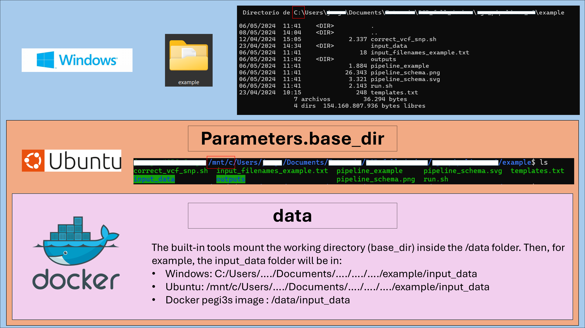
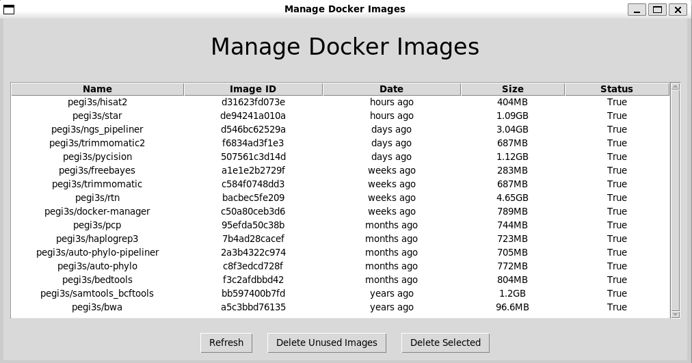
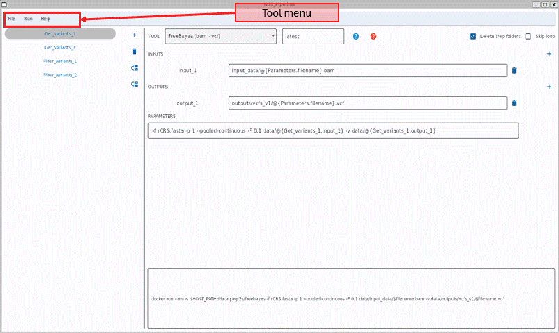

# NGS_pipeliner

**NGS_pipeliner** is a docker-based and easy to use program to develop pipelines. It is mainly focused on the development of pipelines for NGS data analysis (for which it has built-in tools), but is flexible enough to cater to various fields.<br/><br/>
Currently build-in tools are:
- Custom (this one allows you to run any custom script)
- [Bwa](https://bio-bwa.sourceforge.net/bwa.shtml)
- [Bedtools](https://bedtools.readthedocs.io/en/latest/content/bedtools-suite.html)
- [FastQC](https://www.bioinformatics.babraham.ac.uk/projects/fastqc/Help/)
- [FreeBayes](https://github.com/freebayes/freebayes/blob/master/README.md)
- [Gatk-4](https://gatk.broadinstitute.org/hc/en-us/articles/360037224712--Tool-Documentation-Index)
- [Haplogrep](https://haplogrep.readthedocs.io/en/latest/parameters/)
- [Pycision](https://github.com/Ahhgust/Pycision/blob/master/README.md)
- [RtN](https://github.com/Ahhgust/RtN/blob/master/README.md)
- [Samtools](https://www.htslib.org/doc/samtools.html) 
- [Seqkit](https://bioinf.shenwei.me/seqkit/usage/)
- [Trimmomatic](http://www.usadellab.org/cms/?page=trimmomatic)
- [VCFtools](http://vcftools.sourceforge.net/man_latest.html)

## How does NGS_pipeliner work?


NGS_pipeliner runs inside a linux-based system, but it can run on Windows using the WSL (Windows Subsystem for Linux). It is packaged inside a docker container, this allows to run it in any computer without the need for installing numerous dependencies. The only requirement is having [docker](https://docs.docker.com/manuals/) installed.

With NGS_pipeliner docker image you can:
- Design your pipeline
- Plan the execution stragegy
- Select the files you want to process
- Generate a execution file

Once you generate a execution file (run.sh), you can run the pipeline at any time by executing it in your linux terminal.

The idea of generating a pipeline is to combine multiple execution steps into one seamless execution. For each one of these steps you can use the tools included with the NGS_pipeliner or use your custom tools.

All the tools included with the NGS_pipeliner are packaged inside a docker container and maintained in the [pegi3s repository](https://pegi3s.github.io/dockerfiles/). This means that they dont need to be compiled/installed on your system for the pipeline to work. The first time you use one of the tools in a pipeline it will automatically download the docker image for the desired tool, in the following executions it will already be installed in the system.

Being based on docker, each one of the tools is a virtual machine running inside of our system. To pass our data to this machine we have to mount our working directory (base_dir) inside the docker image. All built-in tools will mount the working directory inside the /data directory of the docker image. This is key to avoid problems during the execution of the pipeline. If the paths are not correct it will give "File not found" errors during execution.




## Installation
### Windows

This is the best way to run Docker images in a computer running Windows. They are
based on the instructions given in:
https://canonical-ubuntu-wsl.readthedocs-hosted.com/en/latest/guides/install-ubuntuwsl2/
and
https://docs.docker.com/engine/install/ubuntu/#uninstall-docker-engine

If you encounter any problems during the installation is probably due to the need of restarting either the Ubuntu console or the whole system, before proceeding to the next step. This does not occur in all computers.

- **Step 0: Check if the virtualization option is enabled.**<br/>
The following approach requires that the virtualization option is enabled in your BIOS,
which is the case for most recent laptops.
- **Step 1: Install Windows Subsystem Linux.**<br/>
Open a PowerShell prompt as an Administrator and run the following command:

    ```
    wsl.exe -–install
    ```

- **Step 2:Install Ubuntu using the Microsoft Store.**<br/>
If you have just installed Windows Subsystem Linux, it should have installed Ubuntu along the way. You can check by typing ubuntu in the search bar. If it is already installed you can skip this step.

    If you don't have it or want to have a separate ubuntu installation:

    Press the Windows button, type “Microsoft Store” in the search bar, and run the application.
    In the “Microsoft Store” search bar, type Ubuntu, choose the distribution you want, and then click on the “Get” button. During the installation, you will be asked to give a name to the super user account, that could be different from the name of your Windows account, and set the respective password.
Once the installation is completed, a new app, named "Ubuntu” will be available, that can be accessed by pressing the Windows button, typing “Ubuntu” in the search bar, and running the application. When this is done, a command line terminal appears.


Now that you have Ubuntu installed, you can follow the Linux steps in the Ubuntu terminal. All your Windows directories will be mounted in the */mnt* directory. Take that into account when loading the working directory in NGS_pipeliner. For example, if your project's directory is *C:/Users/<windows_username>/Documents/Project_example*, inside Ubuntu it will be */mnt/c/Users/<windows_username>/Documents/Project_example*. Try to not use whitespaces in the directories you mount into the Docker images (e.x. Project_example instead of Project example).

### Linux
- **Step 0:**<br/>
If you already have xorg and Docker installed you can skip these steps and run the image directly.

- **Step 1:**<br/>
Update Ubuntu repositories.<br/>
In the Ubuntu terminal run the following commands (you will be asked for the super user password):

    ```
    sudo apt-get update
    ```
    ```
    sudo apt-get upgrade
    ```
- **Step 2:**<br/>
Install xorg (required to run Docker images with graphical interface). <br/>
In the Ubuntu terminal run the following command (you will be asked for the super user password):

    ```
    sudo apt install -y xorg xinit
    ```
- **Step 3:**<br/>
Install Docker.<br/>
Run the following commands one by one:

    ```
    sudo apt-get install ca-certificates curl
    ```
    ```
    sudo install -m 0755 -d /etc/apt/keyrings
    ```
    ```
    sudo curl -fsSL https://download.docker.com/linux/ubuntu/gpg -o /etc/apt/keyrings/docker.asc
    ```
    ```
    sudo chmod a+r /etc/apt/keyrings/docker.asc
    ```
    ```
    echo "deb [arch=$(dpkg --print-architecture) signed-by=/etc/apt/keyrings/docker.asc] https://download.docker.com/linux/ubuntu $(. /etc/os-release && echo "$VERSION_CODENAME") stable" | sudo tee /etc/apt/sources.list.d/docker.list > /dev/null
    ```
    ```
    sudo apt-get update
    ```
    ```
    sudo apt-get install docker-ce docker-ce-cli containerd.io docker-buildx-plugin docker-compose-plugin
    ```
- **Step 4:**<br/>
Change Docker permissions so that the user does not need to use sudo to run Docker images.<br/>
Run the following commands one by one:
    ```
    sudo groupadd docker
    ```
    ```
    sudo gpasswd -a $USER docker
    ```
- **Step 5:**<br/>
To test the installation run the following command:
    ```
    docker run hello-world
    ```
    If you get an error in this step, proceed to step 6, then do step 5 again.

    If you still get an error and are using an old version of Ubuntu it may cause problems installing/running docker. Specially images with graphical images. In this case it is usually better to install a secondary fresh Ubuntu image to run docker.
- **Step 6:**<br/>
Reboot your computer. Docker Images with a graphical interface may not be displayed properly until you reboot your computer.
- **Step 7:**<br/>
Please note that in order to run Docker images with a graphical interface you may need to run the following command first:
    ```
    xhost +
    ```
- **Step 8:**<br/>
You are now ready to run the NGS_pipeliner (and every other pegi3s Docker image).

## Uninstalling NGS_pipeliner
If you are using Windows, you can just uninstall the whole Ubuntu system, that will remove NGS_pipeliner and all the other tools installed.

If you are using a Linux system or you don't want to delete the whole Ubuntu you can uninstall NGS_pipeliner or any of the other tools by using docker commands or visually via the [pegi3s/docker-manager](https://hub.docker.com/r/pegi3s/docker-manager/).



## Usage

### Opening the GUI

Start by running the tool's docker image. In the following command make sure to replace:

- **/your_data_dir**: for the global path to the folder where you want to create the pipeline. This folder must also contain all the input files that you want to use.

Run the command inside your linux terminal.

```bash
docker run --rm -ti \
    -v /your_data_dir:/data \
    -e HOST_PATH=/your_data_dir \
    -e USERID=$UID \
    -e USER=$USER \
    -e DISPLAY=$DISPLAY \
    -v /var/db:/var/db:Z \
    -v /tmp/.X11-unix:/tmp/.X11-unix \
    -v $HOME/.Xauthority:/home/developer/.Xauthority \
    -v /var/run/docker.sock:/var/run/docker.sock \
    pegi3s/ngs_pipeliner
```

### GUI overview



## Example 1: Loading a pipeline and creating an execution file

This example teaches how to:
- Open the NGS_pipeliner GUI
- Load a previously developed pipeline
- Create the inputs file
- Load an existing inputs file
- Generate the two types of execution files
- Execute a pipeline

### What is the example pipeline about?
The example pipeline is a really simple variant calling pipeline. The inputs are BAM files containing mtDNA sequences aligned to the reference mtDNA sequence (rCRS).
Each of these files is processed by FreeBayes (a variant caller), with two different set of parameters:

- *Get_variants_1*: F (heteroplasmy threshold) = 0.1
- *Get_variants_2*: F (heteroplasmy threshold) = 0.05

Then the resulting variants files (VCF) are proccesed by a custom script (correct_vcf_snp.sh) to eliminate non-SNP variants and blacklisted positions:

- *Filter_variants_1*: Filters the result of *Get_variants_1*
- *Filter_variants_2*: Filters the result of *Get_variants_2*

### Running the example

1. **Download the example folder** from [webpage_link](https://github.com/pegi3s/dockerfiles/tree/master/ngs_pipeliner/example)

2. **Open the pipeline designer GUI**<br/>
    ```bash
    docker run --rm -ti \
        -v /path_to_example_folder:/data \
        -e HOST_PATH=/path_to_example_folder \
        -e USERID=$UID \
        -e USER=$USER \
        -e DISPLAY=$DISPLAY \
        -v /var/db:/var/db:Z \
        -v /tmp/.X11-unix:/tmp/.X11-unix \
        -v $HOME/.Xauthority:/home/developer/.Xauthority \
        -v /var/run/docker.sock:/var/run/docker.sock \
        pegi3s/ngs_pipeliner
    ```

3. **Load the pipeline**<br/>
Navigate to File/Load pipeline and select the pipeline_example file inside the example folder (which will be ***data*** folder inside the docker image).


4. **Creating the inputs file**<br/>
For this example two BAM files are included inside the input_data folder (sample_1.bam, sample_2.bam).
To load the files into the program, first we need to create a txt file with the names of the input files.This file can either be created manually in a text editor or using the tool included in the GUI. To use the tool inside the GUI:
    1. Navigate to File/Create inputs file
    2. In the pop-up window select the necessary input files and click on "OK"
    3. When created automatically the inputs file will be named *input_filenames.txt*. The inputs file should look like this:<br/><br/>
        ```
        sample_1
        sample_2

        ```

5. **Loading the inputs**<br/>
This will tell NGS_pipeliner the samples that it needs to process. Navigate to File/Load inputs and select the inputs file (the txt file created in step 4).

6. **Creating the execution file**<br/>
There are two types of execution supported:<br/>
 - Files loop: This will execute the entire pipeline for a sample, before going to the next sample.<br/>
 - Steps loop: This will execute all samples for a step before going to the next step.<br/><br/>
To select the type of execution you want, navigate to Run/Loop type. Then, to generate the execution file Run/Generate execution file.<br/><br/>
The execution file will be named ***run.sh*** and it will be created in the base directory for the project.<br/><br/>
Instructions for the creation of all folders necessary for the execution of the program (if they don't already exist) will be included in the run.sh file.<br/><br/>
A pipeline schema in svg and png will be created in the base directory as well. The svg can be modified later on to change the fields you want.

    

7. **Running the execution file**<br/>
The execution file is built using global paths so you can execute it from anywhere in your local machine. If you are a Windows user and you are working with an Ubuntu image it should be executed inside Ubuntu.<br/>
If you are already in the project directory, run:
    > ./run.sh

    If you are in any other folder, run:

    > /path_to_project_folder/run.sh

    Depending on the chosen execution type you should get one of the following outputs (times will not appear, they are just for you to know how much time does it take to execute in on an average laptop):

    

## Example 2: Creating the example pipeline

This example assumes prior knowledge of the concepts explained in example 1. On top of that it teaches how to:

- Create a new project
- Create pipeline steps with tools included in the program
- Create pipeline steps which use custom tools
- Define inputs and outputs for each step
- Create the execution command for each step
- Mark intermediate folders as temporary folders
- Save step templates for later usage
- Create a step from a template

### Running the example

1. **Creating a new project** <br/>
Navigate to File/New Pipeline and select the folder where you want to have your pipeline files. It will create two files inside the folder:
    - ***input_filenames.txt***
    - ***steps***

    These two files can be renamed by the user. Indeed, renaming them will avoid deleting their content by accident when creating a new pipeline again in the same folder.

2. **Load the pipeline**<br/>
By default it will be the steps file, but it can have another name if you rename it.

3. **Creating a new step**<br/>
Pipelines are made up of different steps that are executed in a certain order. To create a new step click on the *Add step* button, then give the step a name in the text field that appears on top of the pipeline schema.<br/><br/>
The step name must not have whitespaces, instead use underscores (step_name) or camelcase (StepName).<br/><br/>
As we are trying to recreate the example pipeline, call this step *Get_variants_1*, then press ENTER on your keyboard. The step should appear now in the pipeline schema.

4. **Adding the inputs and outputs**<br/>
In order for NGS_pipeliner to work properly, inputs and outputs must be defined as relative paths to the base path of the project.<br/>
To add the first input:
    - Enter *Get_variants_1* by clicking in it in the pipeline schema.
    - Click on the *Add input* button
    - Type the relative path to the inputs file in the text field for input_1<br/>

    The relative path for the input is: example/input_data/@{Parameters.filename}.bam<br/><br/>
    @{Parameters.filename} is a variable that references the names in the inputs file. It will be substituted at execution time by the name of each sample.<br/><br/>
    Add the output for this step, try to give the same names/paths that we used in the example to keep it consistent.

5. (Optional) **Experimenting with autocomplete**:<br/>
To write variables easily, autocomplete is enabled in the variables and commands fields.<br/><br/>
Autocomplete will trigger when **@{** is typed in the inputs/outputs/command/parameters text fields.<br/><br/>
Autocomplete will give options to choose between one of the previous variables present in the pipeline. Options can be filtered by typing your search after the **@{** symbol.<br/><br/>
Once the desired option is found, it can be autocompleted by clicking on it (this will automatically add a whitespace after the variable. This is usually the desired behaviour, but not always, and in those cases it must be deleted afterwards).<br/><br/>

    

6. **Creating the command for *Get_variants_1***<br/>
In order to create the command it is key to understand the tool we are working with. All the tools included in this program are packaged inside a docker image to make them portable and consistent. In this case, we are using Freebayes, to learn how to use this tool and its docker image you can use the *Help buttons*.<br/><br/>
The final command should be:
    > -f rCRS.fasta -p 1 --pooled-continuous -F 0.1 data/@{Get_variants_1.input_1} > @{Parameters.base_dir}/@{Get_variants_1.output_1}

    - -f rCRS.fasta to choose the reference sequence
    - -p 1 and --pooled continous are specific options for mtDNA
    - data/@{Get_variants_1.input_1} is the input file. It is inside the data folder because the project folder is mounted on the data folder of the docker image.
    - @{Parameters.base_dir}/@{Get_variants_1.output_1} is the output folder. It is in the @{Parameters.base_dir} folder because that is a varible that references the project path in our local machine.

    You don't need to include the *docker run --rm -v /your_data_dir:/data pegi3s/freebayes* part of the command because that is automatically added when you select the build-in tools.

7. **Creating the *Get_variants_2* step**<br/>
Follow the same steps that you used for *Get_variants_1*, but change the value of -F to 0.05 in the command.

8. **Creating the *Filter_variants_1* step**<br/>
This step is different from the two prior steps. In this case, we will be using a custom script (not included by default in the NGS_pipeliner), to make the procesing of the vcf files.<br/>
This script is in the example folder and has the following syntax:
    > path_to_script/correct_vfc_snp.sh input output (-b)<br/>

    It is important to make sure that:
    - path_to_script is the global path of your local machine.
    - input/output are not just the name of the file, but the global path to the files.
    - the -b is optional. It removes the blacklisted positions.

    Now create the *Filter_variants_1* step selecting 'Custom' in the *Tool selection* button, create the inputs and outputs as we did in the previous steps and build the command as described above. To make sure it is correct, check againsts the provided example.

9. **Saving a custom step as template**<br/>
Sometimes it is interesting to save a certain step to reuse it, either later on in the same pipeline or in other pipelines.<br/><br/>
To save a template:
    - Create an empty text document inside the mounted directory. In our example there is no need to create it it is already inside the example folder. It is called *templates.txt*.
    - Load the templates file into the GUI by navigating to File/Load templates.
    - Save the current step by navigating to File/Save step template (while we have the step we want to save selected).
    - Give a name for the template in the pop-up window and click on yes. As with the steps names it must have no whitespaces. 

10. **Creating a new step from a template**
    - Navigate to the *Add step* button, then click on *Add step from template*
    - On the pop up window give it a Step name (*Filter_variants_2*) and select the template we have just saved.
    - It will add the step and, all the parameters will be already filled up, except for the inputs/outputs. Fill them to read the output of *Get_variants_2* and create a new final VCF file.

11. **Marking folders as temporary**<br/>
The pipeline, as it is, generates four aditional folders (vcfs_v1, vcfs_v2, vcfs_v1_filtered and vcfs_v2_filtered). As we only want to keep the filtered vcfs, we can mark the vcfs_v1 and vcfs_v2 folders as temporary, so the files get deleted when they are not neccesary for the pipeline any more. In order to do this, we just need to select the *Delete steps folders* in the *Get_variants_1* and *Get_variants_2* steps.<br/><br/>
This is extremely important when processing huge files, because the intermediate files can fill up the disk space and make the pipeline fail.

## Additional notes
### Skiping the sample loop
Sometimes a certain step only needs to be executed once and not for all samples (e.x. indexing a reference genome). In these cases it is recommended to mark the **Skip loop** option in order to avoid unnecesary executions.

Keep in mind that if the files loop option is being used and the Skip loop option is selected in a step in the middle of the pipeline, it will divide the pipeline in two parts:
1. for each sample do (all steps prior to the skip loop step)
2. Skip loop step
3. for each sample do (all steps after the skip loop step)

### Changing the Docker tools versions

The Docker tool version for a tool can be changed in the textfield next to the Tool selection box to any of the versions available at the pegi3S Bioinformatics Docker Images project. Default value is "latest". We advise users to use specific versions of the built-in docker images for repetibility purposes.

### Adding your own tools to NGS_pipeliner

Apart from being able to save your custom scripts as templates you can also create a copy of the NGS_pipeliner docker image and add your own tools to work exactly like the build-in tools.

To do this you must first create a docker image of your tool. You can see the dockerfiles that we use to create our docker images in the [pegi3s github](https://github.com/pegi3s/dockerfiles). 

When creating the docker image make sure the program will execute when you mount the input data into the /data folder.

Once you hace created the dockerfile for your image:
- Open the Linux terminal with docker installed
- Go to the directory of your dockerfile
- Run:
    ```
    docker build -t <name_of_your_tool_in_lowercase> -f dockerfile .
    ```
    This will create a docker image of the tool in your system.
- To add this tool to NGS_pipeliner, first clone the [NGS_pipeliner github repository](https://github.com/pegi3s/dockerfiles/tree/master/ngs_pipeliner)

    ```
    git clone  --depth 1 --no-checkout https://github.com/pegi3s/dockerfiles.git
    ```
    ```
    cd dockerfiles
    ```
    ```
    git sparse-checkout set https://github.com/pegi3s/dockerfiles.git/ngs_pipeliner
    ```
    ```
    git checkout
    ```
    ```
    cd ngs_pipeliner
    ```
- In this folder you will have to edit three json files, to include your tool. These files are inside the /for_build directory (tools_compatibility.json, tools_help.json and tools_images.json). In these three files you will have to add: the input/output type of the files processed by the tool, the tool image name and the links to the tool help (if you don't know/have links to the manuals use a random webpage). You can do this in a text editor or automatically by using the add_tool.sh script, which is in the for_build directory as well.
    - To use add_tool.sh go to the /for_build directory and run:
        ```
        ./add_tool.sh "<tool_name>" "<image_name>" "<file_types>" "<link_manual_tool>" "<link_docker_image_help>"
        ```
        Don't use this character "|" in any of the names or it will fail.
        You may need to give it execution privileges first: `xhost +x add_tool.sh`

- Once you have modified the files build the new NGS_pipeliner image:
    - Go to the directory with the dockerfile (/ngs_pipeliner)
    - Build the new image, make sure you don't use pegi3s/ngs_pipeliner as the name, that way you will be overwriting the original image. In the example we have named it modified_ngs_pipeliner.
    ```
    docker build -t modified_ngs_pipeliner -f dockerfile .
    ```
- Now this image should have your tools added and working as if they were included by default and you can use it like you would the pegi3s/ngs_pipeliner image.